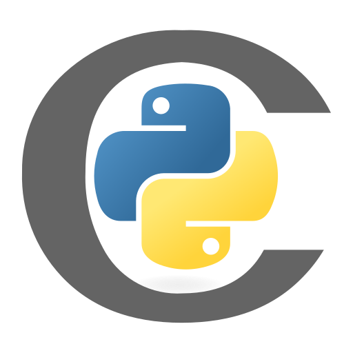
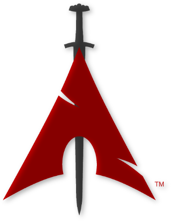

<!--
## To learn
Golang
Kotlin
V
Zig
Julia
Carbon
Nim
Next
Vue
Svelte
Redux
Express      
-->

# 💫 About Me
👨🏻‍💻 I'm a computer engineering student at Instituto Militar de Engenharia.

💼 Currently I'm developing [Workflow project](https://github.com/varad-comrad/Workflow) and studying Neural Networks.

📈 My areas of interest are Neural Networks, Optimization, Big Data and Operating Systems

<!-- 📓  You can see my portfolio [here](https://varad-comrad.github.io) -->

 # 💻 Personal Skills 

## Programming Languages

 
 
 

<!--   -->
<!--   -->

<!--   -->

<!--  -->  
<!--   -->
<!--   -->

<!--  -->
<!--   -->
<!--   -->
<!--    -->

## Scripting Languages

 

 

<!--
## Markup Languages

 

-->

## Databases

 

<!--   -->
<!--   -->
<!--   -->
<!--   -->
<!--   -->

## Full-Stack Developer
###  Front-end

 

<!--  -->
<!--  -->
<!--  -->
<!--  -->
<!--  -->
                                

### Back-end

 
<!--  -->

<!--  -->
<!--  -->

<!--    -->

## Data Science

<!-- ### Tensor operations -->

 
<!--

 
PyArrow
-->

### ETL

 

 
<!--    -->
<!--    -->
<!--    -->

### Data Visualization

 
 
 

### Machine Learning

 

<!--    -->

### Deep Learning

 

<!-- 
### Reinforcement Learning

 
 Gymnasium

### NLP

 
 NLTK

### Statistics

 
 StatsModels
 Pyro

-->

### Computer Vision

 

<!-- YOLO -->

### Softwares

 
<!--  -->

 

<!--

Requests
BeatifulSoup
JAX
 -->
 

## DevOps

### Cloud

 

<!--  -->
<!--  -->

### Container

 

<!--  -->
<!--     -->

### Operating Systems

 

<!--  -->

<!--  -->
<!--  -->

<!--
## Robotics

  
ROS
NAO

 
-->

<!--
## RPA

  
UiPath

 
-->

<!--
## Cyber Security

  

Metasploit

 
-->

## Others

 
<!--  Cmake -->
<!--  RaspberryPi -->
<!--  Figma -->

# 📊 Stats

# 🌐 Socials

  
 
 
 
<!---->

# Top Repositories

<!-- 
# 💼 Organizations:
- RustPython (possibly)
- Asahi Linux (possibly)
- Zig (possibly)
- Carbon (possibly)
-->
